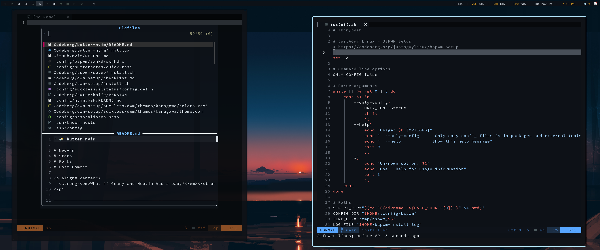

# 🧈 butter-nvim


<p align="center">
  <strong><em>What if Geany and Neovim had a baby?</em></strong>
</p>

---

> For years, my Linux street cred has suffered at the hands of my inability to use Neovim. Yes, I can hear you laughing. butter-nvim is my love for Geany expressed as a Neovim config — and it may save me yet.

Your GUI muscle memory works on day one — `Ctrl+S` saves, `Ctrl+Z` undoes, arrow keys move, Shift+arrow selects, `Ctrl+1`–`Ctrl+9` jump between open files like browser tabs. Discover vim's deeper features (`*` search, text objects, `.` repeat, macros) at your own pace via `which-key` — the menu pops up the moment you press a leader key.

No LSPs. No heavy language tooling. Just a rock-solid Neovim that earns the modal-editing payoff incrementally instead of upfront.



---

## If You Panic

vim has a reputation for trapping people. Here's how to get unstuck in 3 seconds:

| Situation | What to do |
|---|---|
| **Stuck in some weird mode** | Press `Esc` (maybe twice). You're now in normal mode — safe. |
| **Can't type anymore** | You're in normal mode. Press `i` to start typing again. |
| **Did something dumb** | `Ctrl+Z` to undo. `Ctrl+R` (or `Ctrl+Y`) to redo. |
| **Want to save** | `Ctrl+S` — works in any mode. |
| **Want to close nvim** | `:q` then Enter. Save first with `Ctrl+S` if you want to keep changes. |
| **Want to quit *without* saving** | `:q!` then Enter. |
| **Lost track of a file** | `Tab` / `Shift+Tab` to cycle open files. `Ctrl+1`–`Ctrl+9` to jump to a specific one. |
| **Want a menu of every shortcut** | Press `Space` and pause — `which-key` shows everything. |

> **You really can't break anything.** Neovim has unlimited undo, persistent across sessions. If something feels weird, `Esc` then `u` will get you back to safety — every single time.

---

## Features

### Your muscle memory, on by default

- **`Ctrl+S` saves**, **`Ctrl+F`** opens search, **`Ctrl+C`/`Ctrl+V`** for clipboard (yank flashes briefly so you see it took)
- **Arrow keys move**, **`Shift+arrow` selects** — exactly like every GUI editor
- **`Ctrl+1`–`Ctrl+9`** jump between open files like browser tabs
- **`Tab` / `Shift+Tab`** cycle through open files
- **`Ctrl+h/j/k/l`** moves between splits (no `Ctrl+W` prefix mystery)
- **`Alt+↑/↓`** moves the current line or selection
- **`Esc`** clears search highlights and closes popups

### Vim's superpowers, waiting when you want them

- Text objects (`ciw`, `ci"`, `dap`), `.` to repeat the last edit, `*` to find the word under your cursor
- Modal `v` / `V` / `Ctrl+V` for visual selection — and the GUI `Shift+arrow` flow when you don't feel like switching modes
- Full vim search and replace (`:%s/old/new/g`), macros (`qa…q`, `@a`), marks, registers — untouched, all there

### Daily-driver tooling

- Fast startup via a custom plugin manager (`manage.lua`) — no lazy.nvim, no bloat
- Edit the filesystem like text via `oil.nvim`
- Fuzzy file / word / recent-file finding (`fzf-lua`) — bare `nvim` opens straight into Recent Files
- Smart syntax highlighting via Treesitter
- Keybinding discovery via `which-key.nvim` — press `Space` and pause
- Git inline via `gitsigns` (per-hunk stage/reset/preview) + project-wide via `vim-fugitive`
- Toggleable file tree sidebar via `nvim-tree` (`Ctrl+B`)
- Markdown-friendly: spell check on by default, render preview, optional Prettier, no trailing-whitespace meddling
- GitHub-inspired theme with optional transparency

---

## Plugin Highlights

| Plugin                   | Purpose                                 |
|--------------------------|-----------------------------------------|
| `bufferline.nvim`        | Tab-style buffer UI                     |
| `lualine.nvim`           | Statusline customization                |
| `fzf-lua`                | Fast fuzzy finder (files, words, etc.)  |
| `oil.nvim`               | File browser using buffers              |
| `nvim-treesitter`        | Syntax parsing for multiple filetypes   |
| `vim-fugitive`           | Git integration (status, blame, log)    |
| `gitsigns.nvim`          | Inline diff signs + per-hunk actions    |
| `github-nvim-theme`      | GitHub-style colorscheme                |
| `transparent.nvim`       | Toggle background transparency          |
| `nvim-colorizer.lua`     | Inline hex/rgb/css color preview        |
| `indent-blankline.nvim`  | Indentation guides                      |
| `markdown-preview.nvim`  | Live Markdown preview in browser        |
| `render-markdown.nvim`   | Inline Markdown rendering in Neovim     |
| `nvim-autopairs`         | Auto-close brackets, quotes, etc.       |
| `autolist.nvim`          | Auto-continue Markdown lists (optional) |
| `which-key.nvim`         | Keybinding discovery and help           |
| `nvim-tree.lua`          | Toggleable file tree sidebar            |

---

## Installation

> **Requires Neovim 0.10+**
>
> Debian and Ubuntu famously ship old Neovim versions that get frozen for the lifetime of the release. **[ButterRepo](https://codeberg.org/justaguylinux/butterrepo)** is an apt repository that tracks current Neovim stable for Debian/Ubuntu users, so `apt upgrade` keeps you on the latest. If you're on another distro (Arch, Fedora, macOS), your default package manager usually already ships a current Neovim — just use that.

### Quick Install — Debian / Ubuntu (Recommended)

Use the `neovim.sh` installer from [ButterScripts](https://codeberg.org/justaguylinux/butterscripts):

```bash
git clone https://codeberg.org/justaguylinux/butterscripts.git
cd butterscripts/neovim
./neovim.sh butter-nvim
```

This will:
- Add [ButterRepo](https://codeberg.org/justaguylinux/butterrepo) to your apt sources — keeps Neovim current without you waiting for the next Debian release
- Install `neovim`
- Backup any existing config
- Set up this configuration

Launch with `nvim` — plugins install automatically on first launch, and `apt upgrade` will keep Neovim current going forward.

---

### Manual Install (Debian/Ubuntu)

```bash
# 1. Add ButterRepo (provides neovim)
curl -fsSL https://justaguylinux.codeberg.page/butterrepo/key.asc | sudo gpg --dearmor -o /usr/share/keyrings/butterrepo.gpg
echo "deb [arch=amd64 signed-by=/usr/share/keyrings/butterrepo.gpg] https://justaguylinux.codeberg.page/butterrepo stable main" | sudo tee /etc/apt/sources.list.d/butterrepo.list
sudo apt update && sudo apt install neovim

# 2. Backup existing config (if any)
mv ~/.config/nvim ~/.config/nvim.backup

# 3. Clone this config
git clone https://codeberg.org/justaguylinux/butter-nvim ~/.config/nvim

# 4. Launch - plugins auto-install
nvim
```

### Other distributions (Arch, Fedora, macOS, etc.)

```bash
# 1. Install Neovim 0.10+ via your package manager
#    Arch:    sudo pacman -S neovim
#    Fedora:  sudo dnf install neovim
#    openSUSE: sudo zypper install neovim
#    macOS:   brew install neovim
#    others:  https://github.com/neovim/neovim/wiki/Installing-Neovim

# 2. Backup existing config (if any)
mv ~/.config/nvim ~/.config/nvim.backup

# 3. Clone this config
git clone https://codeberg.org/justaguylinux/butter-nvim ~/.config/nvim

# 4. Launch - plugins auto-install on first run
nvim
```

---

## Managing Plugins

Plugins live in `lua/plugin-list.lua` and are handled by the tiny custom manager
in `lua/manage.lua` (no lazy.nvim). On first launch they clone automatically.
Three commands keep them tidy:

| Command       | What it does                                            |
|---------------|---------------------------------------------------------|
| `:PlugUpdate` | `git pull` every installed plugin to the latest commit  |
| `:PlugList`   | List installed plugins                                  |
| `:PlugClean`  | Remove plugins no longer in `plugin-list.lua`           |

> **Heads up — plugins are unpinned.** There's no lockfile (a deliberate
> trade-off for a dead-simple manager), so `:PlugUpdate` always pulls the latest
> upstream commit. That's usually fine, but a breaking change upstream can
> occasionally disrupt the config. If an update misbehaves, you can roll a single
> plugin back with `git -C ~/.local/share/nvim/plugins/<name> checkout <commit>`.

---

## Keybinding Cheatsheet

> `<leader>` is `Space`. All keybindings live in `lua/config/keybinds.lua`.

### General

| Action               | Keybinding         | Description                          |
|----------------------|--------------------|--------------------------------------|
| Save file            | `<C-s>`            | Save (insert mode stays in insert)   |
| Undo                 | `<C-z>`            | Undo last change (no, it doesn't suspend nvim anymore) |
| Redo                 | `<C-y>` or `<C-r>` | Redo                                 |
| Duplicate line       | `<C-d>`            | Copy current line below              |
| Toggle comment       | `<C-/>`            | Comment/uncomment line or selection (built-in `gc`) |
| New line below       | `<Enter>` (normal) | Add line below + drop into insert mode (like Geany) |
| Copy selection       | `<C-c>`            | Copy to system clipboard (Visual or Select mode) |
| Cut selection        | `<C-x>`            | Cut to system clipboard              |
| Paste                | `<C-v>`            | Paste from system clipboard (overrides default Visual Block — use `<C-q>` for that) |
| Last buffer          | `<C-Tab>`          | Toggle between current and most-recent buffer (terminal-dependent) |
| Select all           | `<leader>a`        | Select entire buffer                 |
| Indent left          | `<` (visual)       | Indent left and stay in visual mode  |
| Indent right         | `>` (visual)       | Indent right and stay in visual mode |

### Selection & Movement

| Action               | Keybinding         | Description                          |
|----------------------|--------------------|--------------------------------------|
| GUI-style select     | `<S-Left/Right/Up/Down>` | Hold Shift + arrow to highlight; typing replaces |
| Move line down       | `<A-Down>`         | Move current line down (normal mode) |
| Move line up         | `<A-Up>`           | Move current line up                 |
| Move selection down  | `<A-Down>` (visual) | Move highlighted lines down         |
| Move selection up    | `<A-Up>` (visual)  | Move highlighted lines up            |
| Word jump            | `<C-Left/Right>`   | Jump cursor word-by-word             |

### Search

| Action               | Keybinding         | Description                          |
|----------------------|--------------------|--------------------------------------|
| Find in file         | `<C-f>`            | Open `/` search prompt (GUI-style)   |
| Next match           | `n`                | Next match, screen auto-centered     |
| Previous match       | `N`                | Previous match, screen auto-centered |
| Word under cursor    | `*` / `#`          | Find word at cursor forward/backward |
| Clear highlight      | `<Esc>`            | Clear `hlsearch` highlights          |
| Replace in file      | `:%s/old/new/g`    | Replace all in file (`gc` for confirm) |

### Tabs

> **Tabs vs. open files:** these are vim *tab pages* — full-window layout
> workspaces, like virtual desktops for your splits. They're **not** the
> file-tabs you see in the bar at the top: those are *buffers* (see below),
> which is where your open files live. If you just want to flip between open
> files, use `Tab` / `Shift+Tab` or `Ctrl+1`–`Ctrl+9`.

| Action               | Keybinding         | Description                          |
|----------------------|--------------------|--------------------------------------|
| New tab              | `<leader>t`        | Create new tab page                  |
| Close tab            | `<leader>x`        | Close current tab page               |
| Next tab             | `<leader>j`        | Tab forward                          |
| Previous tab         | `<leader>k`        | Tab backward                         |

### Buffers

| Action               | Keybinding         | Description                          |
|----------------------|--------------------|--------------------------------------|
| Next buffer          | `<Tab>`            | Buffer forward                       |
| Previous buffer      | `<S-Tab>`          | Buffer backward                      |
| Jump to buffer N     | `<C-1>` … `<C-9>`  | Jump to Nth bufferline tab (Geany-style; needs ghostty/wezterm) |
| Close buffer         | `<leader>q`        | Close current buffer                 |

### Splits

| Action               | Keybinding         | Description                          |
|----------------------|--------------------|--------------------------------------|
| Vertical split       | `<leader>v`        | Open vertical split                  |
| Horizontal split     | `<leader>s`        | Open horizontal split                |
| Move between splits  | `<C-h/j/k/l>`      | Jump left/down/up/right (no `<C-w>` prefix) |
| Resize splits        | `<A-Left/Right>`   | Adjust vertical split width          |

### File Navigation

> **Two ways to browse files, on purpose.** `oil.nvim` (`<leader>e`) opens a
> floating buffer where you edit the filesystem like text — great for quick
> create/rename/delete in the current directory. `nvim-tree` (`Ctrl+B`) is the
> persistent sidebar you keep open while you work. Use whichever fits the moment.

| Action               | Keybinding         | Description                          |
|----------------------|--------------------|--------------------------------------|
| File explorer        | `<leader>e`        | Open `oil.nvim` float                |
| Find file            | `<leader>ff`       | Fuzzy file search                    |
| Live grep            | `<leader>fw`       | Grep for word/project search         |
| Recent files         | `<leader>fr`       | Pick from recently opened files      |
| Find help            | `<leader>fh`       | Search help tags                     |
| Find config          | `<leader>fc`       | Search files in Neovim config dir    |
| Find via zoxide      | `<leader>fz`       | Jump nvim's cwd to any visited dir + open file picker |

### Git

| Action               | Keybinding         | Description                          |
|----------------------|--------------------|--------------------------------------|
| Git status           | `<leader>gg`       | Open fugitive Git status             |
| Git branches         | `<leader>gc`       | Browse and switch branches           |

### File Tree (nvim-tree)

| Action               | Keybinding         | Description                          |
|----------------------|--------------------|--------------------------------------|
| Toggle tree          | `<C-b>`            | Show / hide the sidebar (Geany's `Alt+,` equivalent) |
| Open file            | `Enter` (in tree)  | Open file under cursor               |
| Create file / dir    | `a` (in tree)      | Add — append `/` to make a directory |
| Rename               | `r` (in tree)      | Rename file or directory             |
| Delete               | `d` (in tree)      | Delete file or directory             |
| Show help            | `g?` (in tree)     | Full keymap reference inside the tree |

### Hunk (Gitsigns)

Active only in files inside a git repo. Shows `+`/`~`/`_` in the gutter for added/changed/removed lines.

| Action               | Keybinding         | Description                          |
|----------------------|--------------------|--------------------------------------|
| Next hunk            | `]c`               | Jump to next changed hunk            |
| Previous hunk        | `[c`               | Jump to previous changed hunk        |
| Preview hunk         | `<leader>hp`       | Show diff for hunk in float          |
| Stage hunk           | `<leader>hs`       | Stage just this hunk                 |
| Reset hunk           | `<leader>hr`       | Discard this hunk's changes          |
| Diff this file       | `<leader>hd`       | Open a diff split of the file        |
| Blame line           | `<leader>hb`       | Show full blame for current line     |
| Toggle line blame    | `<leader>ht`       | Inline blame on every line          |

### Markdown

| Action               | Keybinding         | Description                          |
|----------------------|--------------------|--------------------------------------|
| Markdown preview     | `<leader>pp`       | Toggle browser preview               |
| Prettier format      | `<leader>pf`       | Format with Prettier (optional)      |

---

## Requirements

- [`ripgrep`](https://github.com/BurntSushi/ripgrep) (`apt install ripgrep`)
- [`fd`](https://github.com/sharkdp/fd) (`apt install fd-find`)
- A **Nerd Font** terminal (for icons and symbols)

---

## Optional: Markdown Formatting with Prettier

This config includes optional support for formatting Markdown files using [Prettier](https://prettier.io).

### Benefits
- Cleans up messy tables
- Aligns list spacing
- Beautifies headers, paragraphs, and spacing

### Usage
1. Install Prettier globally:

   ```bash
   npm install -g prettier
   ```

2. Press `<leader>pf` in any `.md` file to format it.

If Prettier is missing, a friendly error message will be shown in Neovim.

> Prettier is optional — this config works great without it, but it's a nice tool for polished Markdown.

---

## Browser Preview for Markdown

Press `<leader>pp` in any Markdown file to open a live-updating preview in your **system default browser** (whatever `xdg-open` is wired to).

### Forcing a specific browser

```lua
-- in after/plugin/editing.lua
vim.g.mkdp_browser = "firefox" -- optional override
```

### Tiling window manager users (dwm, i3, sway, Hyprland, etc.)

If your browser already runs on a specific workspace, the default preview will open a tab in that browser — which means the WM will pull your focus over to wherever the browser lives. Two common workarounds:

**Firefox with a dedicated profile** (creates a second Firefox process, lands on current workspace):

```lua
vim.g.mkdp_browser = "firefox --new-instance -P preview --new-window"
```

One-time setup: `firefox -P` → Create Profile → name it `preview`.

**Chromium with a throwaway profile** (no setup, always a fresh process):

```lua
vim.g.mkdp_browser = "chromium --user-data-dir=/tmp/mkdp-preview --new-window"
```

---

## Directory Layout

```text
nvim/
├── init.lua               → Entry point
├── lua/
│   ├── config/
│   │   ├── autocmds.lua   → Autocommands (yank flash, spell, trim ws)
│   │   ├── keybinds.lua   → Key mappings
│   │   └── options.lua    → Editor options
│   ├── manage.lua         → Custom plugin manager
│   └── plugin-list.lua    → Plugin definitions
├── after/plugin/          → Plugin configurations
│   ├── editing.lua
│   ├── git.lua            → gitsigns setup + hunk keymaps
│   ├── navigation.lua     → oil + fzf-lua + auto-open on bare nvim
│   ├── tree.lua           → nvim-tree setup + Ctrl+B toggle
│   ├── treesitter.lua
│   └── ui.lua
└── screenshots/
```

---

## Credits

This config is based on [tonybanters/nvim](https://github.com/tonybanters/nvim), which provided the foundation including:
- The lightweight plugin manager (`manage.lua`) — a clever lazy.nvim alternative
- The modular directory structure
- The plugin-list approach

---

## License

GPL-2.0 - See [LICENSE](LICENSE) for details.

## Support

<a href="https://www.buymeacoffee.com/justaguylinux" target="_blank"></a>

## Connect

- [YouTube](https://youtube.com/@justaguylinux) — tutorials and guides
- [Codeberg](https://codeberg.org/justaguylinux) — source code and projects
- [The Butter Lab](https://lab.justaguylinux.com) — Discourse forum
- [The Churn](https://justaguylinux.chat) — community chat (Fluxer)
- [Wiki](https://justaguy.wiki) — documentation and guides
- [Mastodon](https://fosstodon.org/@justaguylinux) — @justaguylinux@fosstodon.org
- [Butterbian](https://butterbian.org) — a Debian-based distro

---

Made with butter by JustAGuyLinux
